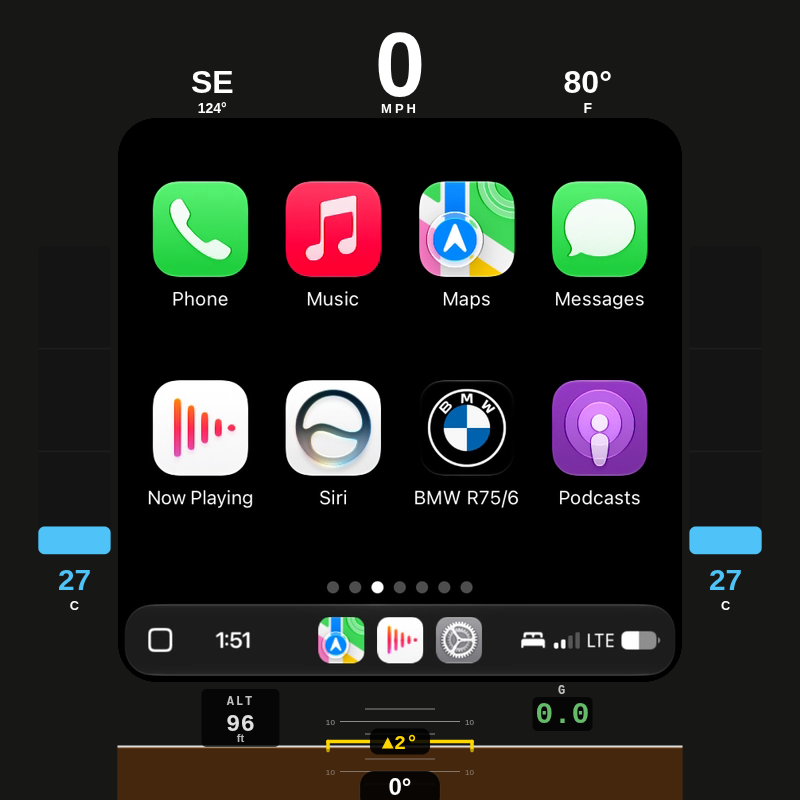

<p align="center">
  <a href="https://byronthegreat.com/projects/motocarplay/"></a>
  
  
  
  
</p>

# LIVI - MotoCarPlay v2

**A LIVI-based round-display Apple CarPlay dashboard with live motorcycle
instrumentation, built for a 1975 BMW R75/6.**

**Try the browser demo -> [byronthegreat.com/projects/motocarplay](https://byronthegreat.com/projects/motocarplay/)**
_(the demo tells the project story and simulates the dash in a browser; the
motorcycle build in this repo is the LIVI/Raspberry Pi app)_

This is the version I am carrying forward on the bike. The first MotoCarPlay
prototype proved the round dashboard in
[byroncoughlin/round-carplay](https://github.com/byroncoughlin/round-carplay).
This repo ports that idea onto [LIVI](https://github.com/f-io/LIVI): native
GStreamer projection, an embedded Linux compositor, a cleaner Pi app lifecycle,
and a settings surface reduced to the controls that matter on the motorcycle.

CarPlay runs in the largest square that fits inside an 800x800 round Waveshare
display. The curved space around it becomes the instrument cluster: speed,
heading, altitude, ambient temperature, cylinder-head temperature on both jugs,
lean, pitch, G-force, GPS diagnostics, and Pi CPU temperature.

<p align="center">
  
</p>

> The screenshots in this README are from the LIVI/MotoCarPlay v2 Pi build, not
> the old round-carplay prototype.

---

## What it does

### CarPlay in a round screen

The phone sees an 800x800 CarPlay surface. LIVI then uses a 118 px view-area
inset on each side so the visible CarPlay card lands as a 565x565 square inside
the round display. The overlay treats the remaining curved bands as motorcycle
gauges.

| Area | What it shows |
|---|---|
| **Top** | Compass heading, GPS speed, ambient temperature |
| **Bottom** | Altitude, lean-angle inclinometer, pitch, G-force |
| **Left / Right** | Cylinder-head temperature, one bar gauge per side |
| **Center** | CarPlay from the adapter, rounded to match the dash |

### Live instrumentation

The R75/6 has no OBD port or CAN bus, so the dash learns the bike through
standalone sensors wired to the Pi. GPS supplies speed, heading, altitude, fix
state, satellite count, HDOP, and sky-view diagnostics. Thermocouples under the
spark plugs watch the two cylinder heads. A BNO055 IMU provides lean, pitch, and
G-force. A waterproof DS18B20 reads ambient air, and the Pi reports its own CPU
temperature from inside the enclosure.

### Tap-to-graph history

Tap a metric and the center CarPlay card becomes a live graph. The graph view
keeps the surrounding motorcycle context visible, shows current value plus
rolling min/max, and lets me reset either the graph window or a peak value.
Thermal graphs get risk-color bands so heat reads as a pattern instead of just a
number.

<p align="center">
  
  &emsp;
  
  &emsp;
  
</p>

### Optional backdrop

The square-in-a-circle problem is still real: black corners make the CarPlay
window feel like a separate screen. MotoCarPlay v2 keeps backdrop as an explicit
opt-in because I want normal mode to stay as light as possible.

| Mode | Current behavior |
|---|---|
| **Off** | Normal LIVI video path. No backdrop sampling, blur branch, or renderer fill work. |
| **Average Color** | GStreamer crops the visible CarPlay frame, downsamples it to a 32x32 RGB grid, averages every pixel in C++, and sends a color only when the change is visible. |
| **Blur Glow** | GStreamer builds a native backdrop branch: crop, shrink, blur, and upscale the live frame behind the foreground CarPlay card. |
| **Ambient Fill** | Uses a fixed color instead of a sampled/dynamic CarPlay backdrop. |

The fallback is intentionally boring: if a backdrop pipeline cannot be built,
the app falls back to the normal projection pipeline.

### Time without WiFi

A Pi has no reliable clock after power-off unless it has help. The Pi 5 RTC
battery keeps time across shutdowns, and `gps.py` can set system time from GPS
UTC on the first valid fix if the clock is badly wrong. See
[`PI_SETUP.md`](PI_SETUP.md#gps-clock-set-no-wifi-time-fix).

---

## Current Settings

The old prototype had one crowded settings panel with stream fields, audio
toggles, kiosk mode, sample-data toggles, and bindings all mixed together. The
LIVI motorcycle build is deliberately smaller. Its active Settings surface is
split into **System** and **Moto Display**.

<p align="center">
  
</p>

### System

These are the connection and projection controls I actually use on the bike.

| Setting | Typical | What it does |
|---|---|---|
| **Wi-Fi Frequency** | 5 GHz | Chooses the dongle wireless band for CarPlay. |
| **Auto Connect** | On | Lets LIVI bring the adapter/phone session back automatically. |
| **Preferred Connection** | Dongle | Keeps the Carlinkit path preferred over native/auto transport choices. |
| **FPS** | 45 | Projection frame rate requested from the phone. Lower than 60 keeps the Pi calmer. |
| **DPI** | 140 | CarPlay UI density hint. |
| **View Area** | 118 px each side | Insets the 800x800 stream so CarPlay fits the round display as a 565x565 card. |
| **USB Dongle Info** | - | Live adapter/protocol/status details for debugging the Carlinkit connection. |
| **About** | - | App/version/about information. |

### Moto Display

This section controls the motorcycle-specific layer around CarPlay.

| Control | What it does |
|---|---|
| **Backdrop** | Completely enables/disables CarPlay-derived backdrop work. Off means the regular no-backdrop mode stays on the normal projection path. |
| **Backdrop Style** | Chooses **Average Color** or **Blur Glow** when backdrop is enabled. |
| **Ambient Fill** | Uses a fixed fill color around the CarPlay card. |
| **Fill Color** | Picks the fixed ambient fill color. |
| **Round Corners** | Applies the mask that keeps the CarPlay card visually rounded. |
| **Tilt Calibration** | Stores lean/pitch offsets with the bike sitting level. |
| **Graph History** | Clears the rolling graph samples. |

Projection/backdrop mode changes are treated as app-lifecycle changes. When I
save one, the settings window closes and the app relaunches cleanly instead of
waiting on a partial adapter reset.

---

## Parts list

Everything connects to the Pi's GPIO or USB. Prices are what I actually paid
(USD); yours will vary. Purchase links are either the exact product page I used
or a search link for the same part family when the original listing was generic.

### Compute & display

| Part | What I used | Qty | Price | Link |
|---|---|--:|--:|---|
| Pi 5 (2GB) + active cooler + case | iRasptek Basic Kit for Raspberry Pi 5 (2GB) | 1 | $110.99 | [search](https://www.amazon.com/s?k=iRasptek+Basic+Kit+Raspberry+Pi+5+2GB) |
| microSD card | SanDisk Extreme PRO 32GB (A1 / U3 / V30) | 1 | $31.99 | [search](https://www.amazon.com/s?k=SanDisk+Extreme+PRO+32GB+A1+U3+V30+microSD) |
| Round touchscreen | Waveshare 3.4" HDMI Round, 800x800 IPS, 10-pt touch | 1 | $105.99 | [search](https://www.amazon.com/s?k=Waveshare+3.4+inch+HDMI+Round+LCD+800x800) |
| Enclosure | 3D-printed Pi case + display back (own filament) | 1 | DIY | - |

### CarPlay

| Part | What I used | Qty | Price | Link |
|---|---|--:|--:|---|
| Wireless CarPlay adapter | Carlinkit **CPC200-CCPA** | 1 | $55.99 | [search](https://www.amazon.com/s?k=Carlinkit+CPC200-CCPA) |

### Sensors

| Part | What I used | Qty | Price | Link |
|---|---|--:|--:|---|
| GPS receiver | Adafruit Ultimate GPS GNSS w/ USB (99-ch, 10 Hz) | 1 | $29.95 | [Adafruit](https://www.adafruit.com/product/4279) |
| GPS antenna | Adafruit External Active Antenna, 28 dB, 5 m, SMA | 1 | $21.50 | [Adafruit search](https://www.adafruit.com/search?q=external%20active%20GPS%20antenna%2028dB%205m%20SMA) |
| Antenna pigtail | u.FL -> SMA RG178 jumper (5-pack, used 1) | 1 | $6.99 | [search](https://www.amazon.com/s?k=u.FL+to+SMA+RG178+jumper) |
| GPS backup cell | CR1220 coin cell (GPS module almanac, faster warm fix) | 1 | $2.49 | [search](https://www.amazon.com/s?k=CR1220+coin+cell) |
| IMU (lean / pitch / G) | Adafruit **BNO055** 9-DOF (UART mode) | 1 | $39.10 | [Adafruit](https://www.adafruit.com/product/2472) |
| Ambient temp | BOJACK **DS18B20** waterproof probe kit (incl. pull-up) | 1 | $8.99 | [search](https://www.amazon.com/s?k=DS18B20+waterproof+temperature+probe) |
| CHT amplifier | Adafruit **MAX31856** universal thermocouple board | 2 | $35.00 | [Adafruit](https://www.adafruit.com/product/3263) |
| CHT thermocouple | K-type probe w/ **14 mm** spark-plug washer, 3 m lead | 2 | $31.98 | [search](https://www.amazon.com/s?k=K-type+thermocouple+14mm+spark+plug+temperature+probe) |

### Real-time clock

| Part | What I used | Qty | Price | Link |
|---|---|--:|--:|---|
| RTC battery | ML2032 rechargeable Li coin cell | 1 | $8.99 | [search](https://www.amazon.com/s?k=ML2032+rechargeable+coin+cell) |
| RTC holder | RTC battery box for Pi 5 (cell not included) | 1 | $5.49 | [search](https://www.amazon.com/s?k=Raspberry+Pi+5+RTC+battery+box+ML2032) |

### Cabling & adapters

| Part | What I used | Qty | Price | Link |
|---|---|--:|--:|---|
| Jumper wires | 120-pc Dupont kit (M-F / M-M / F-F) | 1 | $8.99 | [search](https://www.amazon.com/s?k=120+pc+Dupont+jumper+wire+kit) |
| HDMI cable | Cable Matters ultra-thin HDMI, 6 ft (2-pack, used 1) | 1 | $15.99 | [search](https://www.amazon.com/s?k=Cable+Matters+ultra+thin+HDMI+6+ft) |
| HDMI right-angle | 180-degree HDMI M-F U-shaped adapter (2-pack, used 1) | 1 | $10.99 | [search](https://www.amazon.com/s?k=180+degree+HDMI+male+female+U+shaped+adapter) |
| Micro-HDMI adapter | Micro-HDMI M -> HDMI F 180-degree angled (2-pack, used 1) | 1 | $9.99 | [search](https://www.amazon.com/s?k=micro+HDMI+male+to+HDMI+female+180+degree+adapter) |
| USB-C -> USB-A cable | Amazon Basics, 6 ft | 1 | $2.82 | [search](https://www.amazon.com/s?k=Amazon+Basics+USB+C+to+USB+A+6+ft+cable) |

**Parts subtotal: about $544** (+ $13.84 Adafruit shipping & tax on the GPS
order). Excludes the 3D-printed enclosure and the iPhone you already own.

> **Why these specific parts:**
> - The R75/6 takes **14 mm** spark plugs, so the thermocouple washers are 14 mm.
> - The **BNO055 runs over UART, not I2C**. I had trouble with it on I2C.
>   Details live in `sensors/imu.py`.
> - The Waveshare panel is **HDMI**, so the Pi 5's micro-HDMI is adapted to it.

---

## Wiring & Pi setup

Full reproduce-from-a-fresh-flash notes live in **[`PI_SETUP.md`](PI_SETUP.md)**:
`config.txt` overlays, sensor wiring pinouts, udev rules, systemd user services,
and the gotchas learned the hard way.

| Sensor | Script | Bus |
|---|---|---|
| BNO055 IMU (lean/pitch/G) | `sensors/imu.py` | UART `/dev/ttyAMA0` |
| CHT left/right (MAX31856 x2) | `sensors/cht_temp.py` | SPI0 (CE0 = left, CE1 = right) |
| Ambient (DS18B20) | `sensors/ambient_temp.py` | 1-Wire (GPIO4) |
| GPS (Adafruit Ultimate, USB) | `sensors/gps.py` | USB serial `/dev/gps` |
| Pi CPU temp | `sensors/pi_temp.py` | `/sys/class/thermal` |

For the physical 40-pin header map, see **[`WIRING.md`](WIRING.md)**.

---

## Build & deploy

This repo builds the current LIVI-based motorcycle app.

```bash
pnpm run install:ci
pnpm run build:armLinux:appimage
```

That produces an arm64 AppImage under `dist/`, named like:

```text
LIVI-*-linux-arm64.AppImage
```

My Pi autostart target is:

```text
/home/byron/LIVI/LIVI.AppImage
```

The app runs the projection/compositor side. The Python sensor scripts run as
systemd user services and send readings to LIVI over local Socket.IO.

---

## Credits

This is a personal build, but it sits on a lot of prior work:

- Current head-unit foundation: [f-io/LIVI](https://github.com/f-io/LIVI)
- Original Raspberry Pi CarPlay work: [f-io/pi-carplay](https://github.com/f-io/pi-carplay)
- Round-screen CarPlay prototype base: [OneMakerShow/round-carplay](https://github.com/OneMakerShow/round-carplay)
- MotoCarPlay v1 prototype/story/demo: [byroncoughlin/round-carplay](https://github.com/byroncoughlin/round-carplay)

Apple and CarPlay are trademarks of Apple Inc. This project is not affiliated
with or endorsed by Apple. Mounting a screen on a motorcycle and reading it
while riding is done at your own risk. Keep your eyes on the road.

## License

MIT. See [`LICENSE`](LICENSE).
