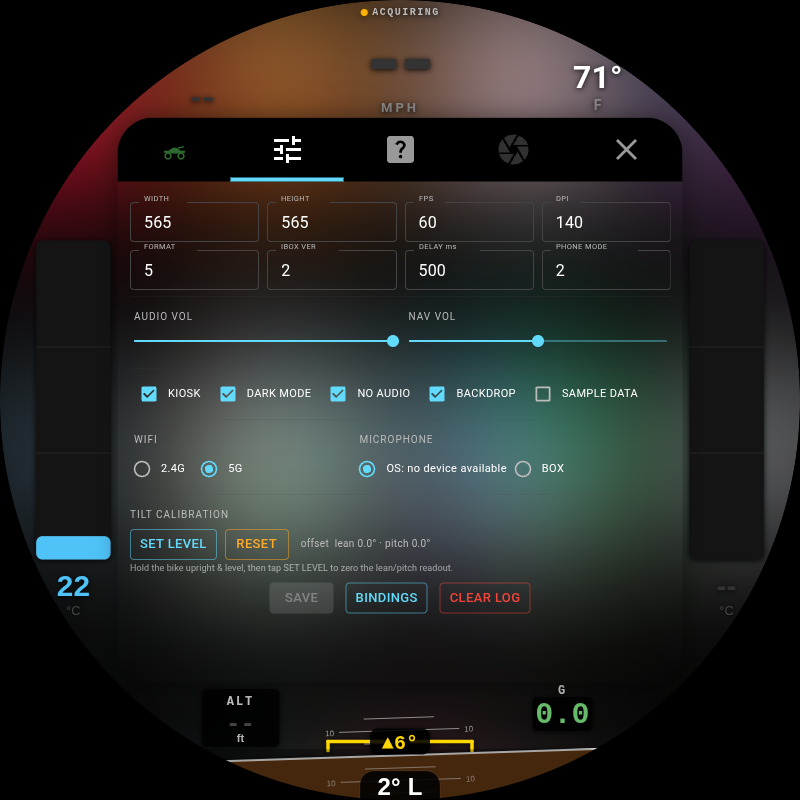

<p align="center">
  <a href="https://byronthegreat.com/projects/motocarplay/"></a>
  
  
  
  
</p>

# LIVI - MotoCarPlay v2

**A hardware-accelerated round-display Apple CarPlay dashboard with live
motorcycle instrumentation, built for a 1975 BMW R75/6.**

**Try the live browser demo -> [byronthegreat.com/projects/motocarplay](https://byronthegreat.com/projects/motocarplay/)**
_(the dashboard UI running in your browser, driven by a simulated ride; the
center CarPlay screen is a static screenshot)_

> **Current version:** this repo is my LIVI-based MotoCarPlay v2 build. The
> original prototype lives in
> [byroncoughlin/round-carplay](https://github.com/byroncoughlin/round-carplay),
> where I first adapted the round-screen idea for the motorcycle dash. This
> version ports that work onto LIVI's modern Raspberry Pi foundation: native
> GStreamer video, an embedded Linux compositor, cleaner restarts, hardware-aware
> rendering, and the same round BMW airhead instrument cluster.

CarPlay runs in a centered square on an 800x800 round screen. The curved space
around it shows sensor data read straight off the bike: cylinder-head temps,
lean/pitch/G, GPS speed and heading, altitude, ambient temperature, and Pi CPU
temperature. The optional backdrop lets CarPlay color bleed out to the bezel,
either as an average sampled color or as a blurred, enlarged glow.

<p align="center">
  
</p>

> Photo note: on-bike photos of the display mounted in the R75/6 dash are still
> coming. The screenshots here are the live dash UI.
<!-- Add real mounted/riding photos here, e.g. documentation/images/bike-01.jpg -->

> **This is a personal build with visible lineage.** LIVI provides the current
> head-unit foundation. My earlier MotoCarPlay prototype started as a hard fork
> of [OneMakerShow/round-carplay](https://github.com/OneMakerShow/round-carplay),
> itself based on [f-io/pi-carplay](https://github.com/f-io/pi-carplay). The
> motorcycle instrumentation is my rebuild for an old BMW with no OBD/CAN bus:
> every reading comes from a sensor wired to the Pi.

---

## What it does

### CarPlay, centered in the circle

Wireless CarPlay, via a Carlinkit adapter, renders in an 800x800 LIVI projection
surface with the view area inset to create the largest clean square inside the
round Waveshare panel. The result is the familiar CarPlay card in the middle and
four curved pockets around it for the motorcycle:

| Arc | Shows |
|---|---|
| **Top** | Compass heading, GPS speed, ambient temperature |
| **Bottom** | Altitude, lean-angle inclinometer, pitch, G-force |
| **Left / Right** | Cylinder-head temperature, one bar gauge per jug, color-coded by heat |

### Optional ambient backdrop

The original prototype used a blurred, enlarged copy of the CarPlay frame to
hide the square-in-a-circle problem. LIVI - MotoCarPlay v2 keeps that idea, but
makes it an explicit opt-in setting.

| Mode | What it does |
|---|---|
| **Off** | Plain normal LIVI rendering. No sampling or backdrop work. |
| **Average Color** | Samples the live CarPlay frame and fills the round edges with a smoothed average color. |
| **Blur Glow** | Samples the live CarPlay frame, enlarges it, blurs it, and lets the color spill into the bezel. |

The backdrop is there for the round-screen look, not as a requirement. I keep it
disabled when I want the lightest possible head-unit mode.

### Live graphing with risk zones

Tap any metric to open a full-screen graph over the CarPlay card: a big live
number, rolling **MIN / MAX**, a **RESET**, and a scrollable history. Graphs that
matter for engine/board health get **color risk bands** painted under the trace:

| Metric | Bands |
|---|---|
| **Cylinder-head temp** | cold (blue) -> normal (green) -> warm (amber) -> hot (red) |
| **Pi CPU temp** | healthy (green) -> warm (amber) -> throttle (red) |

Tap the **ambient** reading and the screen splits into a dual graph: ambient on
top, Pi CPU temperature below. The Pi runs in a sealed case, so the CPU trace
shows thermal headroom at a glance.

<p align="center">
  
  &emsp;
  
</p>

### Keeps the right time without WiFi

A Pi has no clock when it is powered off. Two things fix that. The Pi 5 RTC
battery holds the time across power-off, so the clock is right at boot with no
network. As a backup, `gps.py` sets the system clock from GPS UTC on the first
valid fix when the time is badly off, so the dash stays correct even after days
with no cell or WiFi. See
[`PI_SETUP.md`](PI_SETUP.md#gps-clock-set-no-wifi-time-fix) for details.

---

## Parts list

Everything connects to the Pi's GPIO or USB. Prices are what I actually paid
(USD); yours will vary. Purchase links are either the exact product page I used
or a search link for the same part family when the original listing was generic.

### Compute & display

| Part | What I used | Qty | Price | Link |
|---|---|--:|--:|---|
| Pi 5 (2GB) + active cooler + case | iRasptek Basic Kit for Raspberry Pi 5 (2GB) | 1 | $110.99 | [search](https://www.amazon.com/s?k=iRasptek+Basic+Kit+Raspberry+Pi+5+2GB) |
| microSD card | SanDisk Extreme PRO 32GB (A1 / U3 / V30) | 1 | $31.99 | [search](https://www.amazon.com/s?k=SanDisk+Extreme+PRO+32GB+A1+U3+V30+microSD) |
| Round touchscreen | Waveshare 3.4" HDMI Round, 800x800 IPS, 10-pt touch | 1 | $105.99 | [search](https://www.amazon.com/s?k=Waveshare+3.4+inch+HDMI+Round+LCD+800x800) |
| Enclosure | 3D-printed Pi case + display back (own filament) | 1 | DIY | - |

### CarPlay

| Part | What I used | Qty | Price | Link |
|---|---|--:|--:|---|
| Wireless CarPlay adapter | Carlinkit **CPC200-CCPA** | 1 | $55.99 | [search](https://www.amazon.com/s?k=Carlinkit+CPC200-CCPA) |

### Sensors

| Part | What I used | Qty | Price | Link |
|---|---|--:|--:|---|
| GPS receiver | Adafruit Ultimate GPS GNSS w/ USB (99-ch, 10 Hz) | 1 | $29.95 | [Adafruit](https://www.adafruit.com/product/4279) |
| GPS antenna | Adafruit External Active Antenna, 28 dB, 5 m, SMA | 1 | $21.50 | [Adafruit search](https://www.adafruit.com/search?q=external%20active%20GPS%20antenna%2028dB%205m%20SMA) |
| Antenna pigtail | u.FL -> SMA RG178 jumper (5-pack, used 1) | 1 | $6.99 | [search](https://www.amazon.com/s?k=u.FL+to+SMA+RG178+jumper) |
| GPS backup cell | CR1220 coin cell (GPS module almanac, faster warm fix) | 1 | $2.49 | [search](https://www.amazon.com/s?k=CR1220+coin+cell) |
| IMU (lean / pitch / G) | Adafruit **BNO055** 9-DOF (UART mode) | 1 | $39.10 | [Adafruit](https://www.adafruit.com/product/2472) |
| Ambient temp | BOJACK **DS18B20** waterproof probe kit (incl. pull-up) | 1 | $8.99 | [search](https://www.amazon.com/s?k=DS18B20+waterproof+temperature+probe) |
| CHT amplifier | Adafruit **MAX31856** universal thermocouple board | 2 | $35.00 | [Adafruit](https://www.adafruit.com/product/3263) |
| CHT thermocouple | K-type probe w/ **14 mm** spark-plug washer, 3 m lead | 2 | $31.98 | [search](https://www.amazon.com/s?k=K-type+thermocouple+14mm+spark+plug+temperature+probe) |

### Real-time clock

| Part | What I used | Qty | Price | Link |
|---|---|--:|--:|---|
| RTC battery | ML2032 rechargeable Li coin cell | 1 | $8.99 | [search](https://www.amazon.com/s?k=ML2032+rechargeable+coin+cell) |
| RTC holder | RTC battery box for Pi 5 (cell not included) | 1 | $5.49 | [search](https://www.amazon.com/s?k=Raspberry+Pi+5+RTC+battery+box+ML2032) |

### Cabling & adapters

| Part | What I used | Qty | Price | Link |
|---|---|--:|--:|---|
| Jumper wires | 120-pc Dupont kit (M-F / M-M / F-F) | 1 | $8.99 | [search](https://www.amazon.com/s?k=120+pc+Dupont+jumper+wire+kit) |
| HDMI cable | Cable Matters ultra-thin HDMI, 6 ft (2-pack, used 1) | 1 | $15.99 | [search](https://www.amazon.com/s?k=Cable+Matters+ultra+thin+HDMI+6+ft) |
| HDMI right-angle | 180-degree HDMI M-F U-shaped adapter (2-pack, used 1) | 1 | $10.99 | [search](https://www.amazon.com/s?k=180+degree+HDMI+male+female+U+shaped+adapter) |
| Micro-HDMI adapter | Micro-HDMI M -> HDMI F 180-degree angled (2-pack, used 1) | 1 | $9.99 | [search](https://www.amazon.com/s?k=micro+HDMI+male+to+HDMI+female+180+degree+adapter) |
| USB-C -> USB-A cable | Amazon Basics, 6 ft | 1 | $2.82 | [search](https://www.amazon.com/s?k=Amazon+Basics+USB+C+to+USB+A+6+ft+cable) |

**Parts subtotal: about $544** (+ $13.84 Adafruit shipping & tax on the GPS
order). Excludes the 3D-printed enclosure and the iPhone you already own.

> **Why these specific parts:**
> - The R75/6 takes **14 mm** spark plugs, so the thermocouple washers are 14 mm.
> - The **BNO055 runs over UART, not I2C**. I had trouble with it on I2C.
>   Details live in `sensors/imu.py`.
> - The Waveshare panel is **HDMI**, so the Pi 5's micro-HDMI is adapted to it.
>   That's the little stack of HDMI adapters above.

---

## Instrument wiring & Pi setup

Full reproduce-from-a-fresh-flash instructions live in
**[`PI_SETUP.md`](PI_SETUP.md)**: `config.txt` overlays, sensor wiring pinouts,
udev rules, the systemd user services, and the gotchas learned the hard way.

Sensor scripts (`sensors/*.py`) each document their exact wiring in the file
header. Quick map:

| Sensor | Script | Bus |
|---|---|---|
| BNO055 IMU (lean/pitch/G) | `imu.py` | UART `/dev/ttyAMA0` |
| CHT left/right (MAX31856 x2) | `cht_temp.py` | SPI0 (CE0 = left, CE1 = right) |
| Ambient (DS18B20) | `ambient_temp.py` | 1-Wire (GPIO4) |
| GPS (Adafruit Ultimate, USB) | `gps.py` | USB serial `/dev/gps` |
| Pi CPU temp | `pi_temp.py` | `/sys/class/thermal` (no wiring) |

For the full physical pin map, see **[`WIRING.md`](WIRING.md)**.

---

## Build & deploy the app

This repo is the current LIVI-based app. The browser demo remains at
byronthegreat.com, but the motorcycle build is the arm64 AppImage from this
repository.

### Prerequisites

- Node and **pnpm 11.x** (the repo declares `pnpm@11.5.3`)
- Linux build dependencies for Electron, native USB modules, and the LIVI
  compositor/GStreamer packaging scripts
- FUSE/AppImage support on the target Pi

### Build the arm64 AppImage

```bash
pnpm run install:ci
pnpm run build:armLinux:appimage  # -> dist/LIVI-*-linux-arm64.AppImage
```

### Deploy to the Pi

```bash
rsync -az --progress dist/LIVI-*-linux-arm64.AppImage \
  byron@motocarplay.local:/home/byron/LIVI/LIVI.AppImage
```

The Pi autostarts the AppImage on boot; the sensor scripts run as systemd user
services. The app and the Python sensors talk over a local Socket.IO channel.

---

## Settings reference

Open Settings via the tuning icon. Projection/video changes and Moto Display
mode changes can trigger a clean relaunch so the compositor and CarPlay session
come back in the correct mode.

<p align="center">
  
  &emsp;
  
</p>

### System

| Setting | Typical | What it does |
|---|---|---|
| **Wi-Fi Frequency** | 5 GHz | Band the dongle uses for wireless CarPlay. |
| **Auto Connect** | On | Reconnects to the preferred transport automatically. |
| **Preferred Connection** | Dongle | Chooses dongle, native, or automatic transport behavior. |
| **FPS** | 45 | Frames per second requested for the projection stream. |
| **DPI** | 140 | UI scaling hint to the phone. Higher = denser. |
| **View Area** | 118 px per side | Insets the 800x800 stream so CarPlay sits inside the round screen. |
| **USB Dongle Info** | - | Shows dongle identity and connection state. |
| **About** | - | LIVI/app information. |

### Moto Display

| Control | What it does |
|---|---|
| **Backdrop** | Enables/disables the optional ambient backdrop completely. |
| **Backdrop Style** | Switches between **Average Color** and **Blur Glow**. |
| **Ambient Fill** | Uses a fixed fill color around the CarPlay card. |
| **Fill Color** | Chooses that fixed ambient fill color. |
| **Round Corners** | Applies the mask that keeps the CarPlay card visually rounded. |
| **Tilt Calibration** | Zeroes the lean/pitch readout with the bike sitting level. |
| **Graph History** | Clears the rolling graph data. |

---

## Disclaimer

_Apple and CarPlay are trademarks of Apple Inc. This project is not affiliated
with or endorsed by Apple. All trademarks are the property of their respective
owners. Mounting a screen on a motorcycle and reading it while riding is done at
your own risk. Keep your eyes on the road._

## Credits

- Current head-unit foundation: [f-io/LIVI](https://github.com/f-io/LIVI)
- Original Raspberry Pi CarPlay work: [f-io/pi-carplay](https://github.com/f-io/pi-carplay)
- Round-screen CarPlay prototype base: [OneMakerShow/round-carplay](https://github.com/OneMakerShow/round-carplay)
- MotoCarPlay v1 prototype/story/demo: [byroncoughlin/round-carplay](https://github.com/byroncoughlin/round-carplay)

## License

MIT. See [`LICENSE`](LICENSE).
